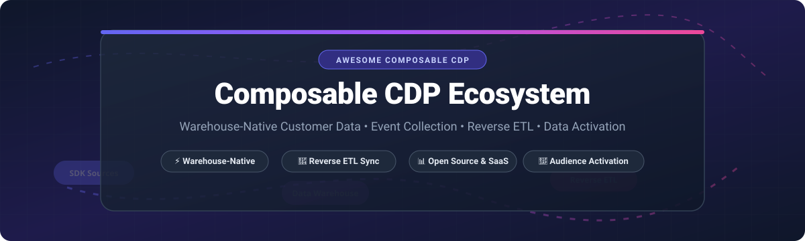

  

# 🚀 Awesome Composable CDP & Data Activation Ecosystem ⚡

  
  
  
  
  

## 📌 Overview & Modern Customer Data Stack Architecture

> **A curated collection of top SaaS platforms and open-source GitHub projects for Composable Customer Data Platforms (CDP), Reverse ETL, Event Collection, Behavioral Tracking, Audience Modeling, and Data Activation.** 

*Last updated: September 2026* 📅

Modern data architecture treats cloud data warehouses (Snowflake, BigQuery, Databricks, Amazon Redshift) as the **single source of truth** for customer profiles. Rather than locking customer data inside black-box, proprietary CDPs, a **Composable CDP** empowers data and engineering teams to assemble modular, best-in-class components:

1. **⚡ Event Collection & Behavioral Tracking:** Collecting real-time user events from web, mobile apps, and backend services into the data warehouse.
2. **🧠 Identity Resolution & Modeling:** Stitching user profiles, identity graphs, and audience segments directly inside the warehouse using SQL / dbt.
3. **🔄 Reverse ETL & Data Activation:** Operationalizing warehouse data by continuously syncing customer traits and audiences into CRMs (Salesforce, HubSpot), ad platforms (Google Ads, Meta), and marketing automation tools (Klaviyo, Braze).

---

## 📑 Table of Contents
- [📊 Market Size & Industry Dynamics](#-market-size--industry-dynamics)
- [☁️ SaaS / Hosted Platforms](#%EF%B8%8F-saas--hosted-platforms)
- [🔓 Open-Source GitHub Projects](#-open-source-github-projects)
- [🤝 How to Contribute](#-how-to-contribute)
- [☕ Support & Sponsorship](#-support--sponsorship)
- [📈 Star History](#-star-history)
- [⚠️ Disclaimer](#%EF%B8%8F-disclaimer)

---

## 📊 Market Size & Industry Dynamics

> **Market Overview:** The global Customer Data Platform (CDP) market is estimated at **$7.4 Billion in 2026** and projected to reach **$28+ Billion by 2032** (growing at a ~28% CAGR). The Composable CDP segment is currently **moderately fragmented**, with category leaders like Twilio Segment, Hightouch, Census (Fivetran Activations), and RudderStack competing alongside open-source engines for market share.

---

## ☁️ SaaS / Hosted Platforms

Below is a comparative breakdown of leading commercial Composable CDP, Reverse ETL, and Customer Data activation platforms, ordered by company size (valuation / estimated market cap / revenue).

| 🏢 Platform | 🌟 Key Features | 💵 Starting Tier Pricing | 🎁 Free Tier / Trial Limits | 📊 Company Size (Valuation / Revenue) |
| :--- | :--- | :--- | :--- | :--- |
| **[Segment](https://segment.com/)** | Classic CDP event collection & routing | **$120 / month** (Team Plan) | **Free Plan**: 1,000 MTUs/month & 2 sources | **$3.2 Billion Valuation** (Acquired by Twilio) |
| **[Hightouch](https://hightouch.com/)** | Warehouse-native audiences & Reverse ETL | **$350 / month** (Starter Tier) | **Free Plan**: 2 active syncs & unlimited seats | **$2.75 Billion Valuation** ($100M+ ARR) |
| **[Tealium](https://tealium.com/)** | Enterprise CDP, tag management & enrichment | **$2,083 / month** ($25,000/year contract) | **14-Day Free Trial** (Custom demo sandbox) | **$1.2 Billion Valuation** |
| **[Census](https://www.getcensus.com/)** | Reverse ETL & data activation (Fivetran) | **$350 / month** (Fivetran Activations) | **Free Plan**: 500,000 MAR/month & 300+ connectors | **$400 Million Valuation** ($35M+ ARR at acquisition) |
| **[RudderStack](https://www.rudderstack.com/)** | Warehouse-native CDP & event pipelines | **$500 / month** (Growth Plan) | **Free Plan**: 250,000 events/month & 30-day trial | **$300 Million Valuation** ($82M total raised) |
| **[mParticle](https://www.mparticle.com/)** | Mobile-first enterprise CDP & real-time routing | **$4,166 / month** ($50,000/year minimum) | **30-Day Free Trial** (Up to 10,000 MTUs) | **$300 Million Valuation** ($76M ARR, acquired by Rokt) |
| **[ActionIQ](https://www.actioniq.com/)** | Enterprise CX hub & hybrid warehouse activation | **$3,000 / month** (Enterprise base contract) | **30-Day Free Trial** (Guided POC sandbox) | **$250 Million Valuation** |
| **[Zeotap](https://zeotap.com/)** | Privacy-first CDP & identity resolution | **$2,500 / month** (Enterprise tier) | **14-Day Free Trial** (Privacy compliance test sandbox) | **$160 Million Valuation** |
| **[Simon Data](https://www.simondata.com/)** | Warehouse-centric journey orchestration | **$2,000 / month** (Growth contract base) | **14-Day Free Trial** (Demo environment) | **$150 Million Valuation** |
| **[GrowthLoop](https://www.growthloop.com/)** | Marketer-friendly composable activation | **$750 / month** (Standard plan) | **14-Day Free Trial** (Full access sandbox) | **$60 Million Valuation** |
| **[MessageGears](https://www.messagegears.com/)** | Direct-from-warehouse messaging activation | **$1,500 / month** (Platform base) | **30-Day Free Trial** (Testing tier) | **$50 Million Valuation** |
| **[Blotout](https://blotout.io/)** | First-party edge collection & cookieless tracking | **$199 / month** (Pro Tier) | **Free Plan**: 50,000 events/month | **$20 Million Valuation** |
| **[Jitsu](https://jitsu.com/)** | Hosted open-source event collection engine | **$99 / month** (Growth Cloud) | **Free Plan**: 200,000 events/month | **$15 Million Valuation** |

---

## 🔓 Open-Source GitHub Projects

Composable CDP architectures are heavily built on open-source projects. Below is a list of top open-source repositories for event streaming, data transformations, reverse ETL, identity resolution, and analytical modeling, sorted by GitHub star count.

| 📦 Repository | 🏷️ Description | ⭐ GitHub Stars (Stargazers) |
| :--- | :--- | :--- |
| **[PostHog / posthog](https://github.com/posthog/posthog)** | Open-source product analytics, event capture, session replay, and feature flags |  |
| **[Airbyte / airbyte](https://github.com/airbytehq/airbyte)** | Leading open-source data integration & ELT platform for warehouse ingestion |  |
| **[dbt Labs / dbt-core](https://github.com/dbt-labs/dbt-core)** | SQL transformation framework for identity stitching & customer 360 models in warehouse |  |
| **[Snowplow / snowplow](https://github.com/snowplow/snowplow)** | Enterprise behavioral data engine for real-time warehouse-native event collection |  |
| **[Inngest / inngest](https://github.com/inngest/inngest)** | Event-driven workflow orchestration engine for real-time user trigger activation |  |
| **[Jitsu / jitsu](https://github.com/jitsucom/jitsu)** | MIT-licensed event collection & stream destination delivery platform (Segment alternative) |  |
| **[RudderStack / rudder-server](https://github.com/rudderlabs/rudder-server)** | Source-available enterprise CDP data plane for event routing, transform & reverse ETL |  |
| **[Meltano / meltano](https://github.com/meltano/meltano)** | CLI-first open-source data integration platform built on Singer taps and targets |  |
| **[Multiwoven / multiwoven](https://github.com/Multiwoven/multiwoven)** | Open-source Reverse ETL platform syncing warehouse data to business tools |  |

---

### 🛠️ Reference Architecture Patterns

1. **Collection Layer:** Deploy **Jitsu**, **RudderStack**, or **Snowplow** to capture real-time clickstream data directly into Snowflake / BigQuery.
2. **Transformation & Identity Layer:** Use **dbt-core** models to stitch user IDs, compute RFM metrics, and define dynamic customer cohorts inside the data warehouse.
3. **Activation Layer:** Sync warehouse segments to Salesforce, HubSpot, Facebook Custom Audiences, and Google Ads using **Multiwoven**, **Hightouch**, or **Census**.

---

## 🤝 How to Contribute

Contributions are welcome! Please follow these simple guidelines:

1. Fork this repository 🍴
2. Create a feature branch (`git checkout -b feature/new-cdp-tool`) 🌿
3. Add the SaaS platform or open-source tool in alphabetical/ranked order following the existing table formatting 📝
4. Open a Pull Request with a short description of the tool 🚀

Check out our curated list directory at [Awesome-Awesome-Awesome](https://github.com/ishandutta2007/Awesome-Awesome-Awesome)!

---

## ☕ Support & Sponsorship

If you find this list useful for building your customer data stack, please consider supporting the project:

- 🌟 **Star this repository** on GitHub
- 🔀 **Fork & Share** with fellow data engineers and growth marketers
- 💖 **Sponsor the Author**: Support further open-source research via [GitHub Sponsors Dashboard](https://github.com/sponsors/ishandutta2007)

---

## 📈 Star History

---

## ⚠️ Disclaimer

This repository is a community-curated collection intended for educational and informational purposes. Products, pricing, and company metrics change frequently; please verify current details on respective official vendor sites.

---

  <b>Made with ❤️ for Data Engineers, Growth Hackers, and Open-Source CDP Enthusiasts worldwide.</b>

